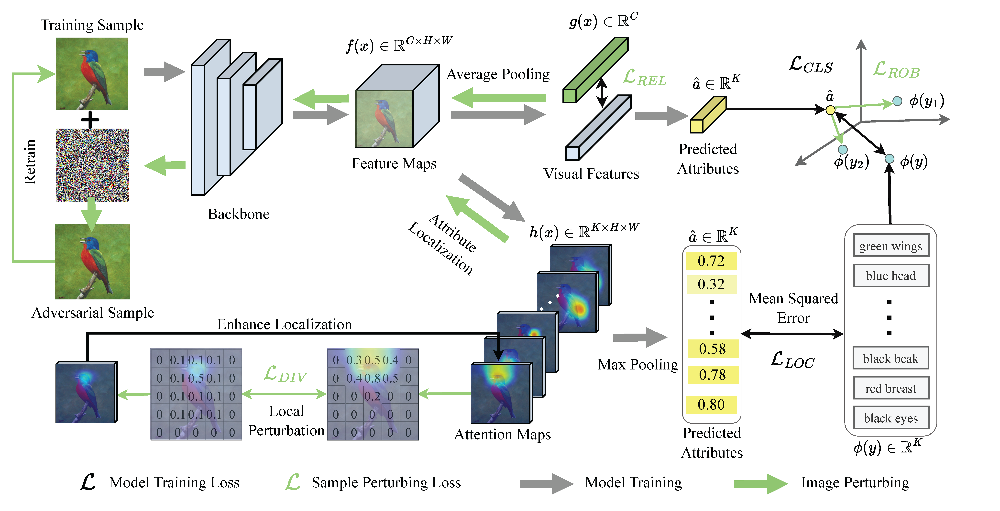

# Zero-Shot Learning by Harnessing Adversarial Samples [ACM Multimedia 2023]


> [**Zero-Shot Learning by Harnessing Adversarial Samples**](https://arxiv.org/pdf/2308.00313)<br>
> [Zhi Chen](https://scholar.google.com.au/citations?view_op=list_works&hl=en&hl=en&user=9ZypKEYAAAAJ), Pengfei Zhang, Jingjing Li, Sen Wang, Zi (Helen) Huang


Official implementation of the paper "[Zero-Shot Learning by Harnessing Adversarial Samples](https://arxiv.org/pdf/2308.00313)".
<hr />


## Highlights


> **<p align="justify"> Abstract:** *Zero-Shot Learning(ZSL) aims to recognize unseen classes by generalizing the knowledge, i.e., visual and semantic relationships, obtained from seen classes, where image augmentation techniques are commonly applied to improve the generalization ability of a model. However,this approach can also cause adverse effects on ZSL since the conventional augmentation techniques that solely depend on single-label supervision is not able to maintain semantic information and result in the semantic distortion issue consequently. In other words,image augmentation may falsify the semantic (e.g., attribute) information of an image. To take the advantage of image augmentations while mitigating the semantic distortion issue, we propose a novel ZSL approach by Harnessing Adversarial Samples(HAS). HAS advances ZSL through adversarial training which takes into account three crucial aspects: (1) robust generation by enforcing augmentations to be similar to negative classes, while maintaining correct labels, (2) reliable generation by introducing a latent space constraint to avert significant deviations from the original data manifold, and (3)diverse generation by incorporating attribute-based perturbation by adjusting images according to each semantic attribute’s localization. Through comprehensive experiments on three prominent zero-shot benchmark datasets,we demonstrate the effectiveness of our adversarial samples approach in both ZSL and Generalized Zero-Shot Learning (GZSL) scenarios.*</p>


## Results
### HAS in comparison with existing methods
Results reported below show accuracy for base and novel classes for across 11 recognition datasets averaged over 3 seeds.


| Name | CUB T1 | U | S | H | AwA2 T1 | U | S | H | SUN T1 | U | S | H  |
|------------|:---------:|:---------:|:---------:|:---------:|:---------:|:---------:|:---------:|:---------:|:---------:|:---------:|:---------:|:---------:|
|[SDGZSL (ICCV21)](https://openaccess.thecvf.com/content/ICCV2021/papers/Chen_Semantics_Disentangling_for_Generalized_Zero-Shot_Learning_ICCV_2021_paper.pdf)|75.5|59.9| 66.4 | 63.0 | 72.1 | 64.6 | 73.6 | 68.8 | 62.4 | 48.2 | 361 | 41.3 | 
|[HSVA (NeurIPS21)](https://arxiv.org/abs/2109.15163)|62.8|52.7|58.3|55.3|-|59.3|76.6|66.8|63.8|48.6|39.0|43.3|
|[APN (NeurIPS20)](https://proceedings.nips.cc/paper/2020/file/fa2431bf9d65058fe34e9713e32d60e6-Paper.pdf)|72.0|65.3|69.3|67.2|68.4|56.5|78.0|65.5|61.6|41.9|34.0|37.6|
|[MSDN (CVPR22)](https://arxiv.org/abs/2203.03137)|76.1|68.7|67.5|68.1|70.1|62.0|74.5|67.7|65.8|52.2|34.2|41.3|
|HAS(ours)|76.5|69.6|74.1|71.8|71.4|63.1|87.3|73.3|63.2|42.8|38.9|40.8|

## Installation 
Python 3.6

PyTorch 1.9.1

All experiments are performed with one NVIDIA A6000 GPU.

## Prerequisites
- Dataset: please download the dataset, i.e., [CUB](http://www.vision.caltech.edu/visipedia/CUB-200-2011.html), [AWA2](https://cvml.ist.ac.at/AwA2/), [SUN](https://groups.csail.mit.edu/vision/SUN/hierarchy.html), and change the opt.image_root to the dataset root path on your machine
- Data split and APN image features: please download the [data](https://drive.google.com/file/d/1bCZ28zJZNzsRjlHxH_vh2-9d7Ln1GgjE/view?usp=sharing) folder and place it in *./data/*.
- Pre-trained models: please download the [pre-trained models](https://drive.google.com/file/d/1c5scuU0kZS5a9Rz3kf5T0UweCvOpGsh2/view?usp=sharing) and place it in *./pretrained_models/*.

## Model Zoo

We provide the trained ZSL model for three datasets as below:

 Dataset          | ZSL Accuracy   |  Download link | GZSL Accuracy |  Download link | 
 |  ----  | ----  | ----  | ----  | ----  |
| CUB          | 76.5                 |[Download](https://drive.google.com/file/d/1fFs1w_OoWYyKN8MFWKf1Q0opjfzXK4HO/view?usp=sharing) | 71.8 | [Download](https://drive.google.com/file/d/1fFs1w_OoWYyKN8MFWKf1Q0opjfzXK4HO/view?usp=sharing)
| AWA2          | 71.4                 |[Download](https://drive.google.com/file/d/1f5aL7zb0aHtZY0ScDHn7uSUy9QmZb7ZK/view?usp=sharing) | 73.3| [Download](https://drive.google.com/file/d/1fErLMBJ2UGz95wd0JS2Wjo7XMua-L5vL/view?usp=sharing)
| SUN          | 63.2                 |[Download](https://drive.google.com/file/d/1fGKYNT-7gK7KUs1yBJc0RntP44UNbKqn/view?usp=sharing) |40.8| [Download](https://drive.google.com/file/d/1euwHO7duQloOUKqUPyTANIXqAShGRqqs/view?usp=sharing)


## Training and Evaluation
Please refer to the [train.sh](scripts/train.sh) and [eval.sh](scripts/eval.sh) for detailed instructions on training, evaluating and reproducing the results using our pre-trained models.


<hr />

## Citation
If you use our work, please consider citing:
```bibtex
@inproceedings{khattakMaPLe,
    title={Zero-Shot Learning by Harnessing Adversarial Samples},
    author={Chen, Zhi and Zhang, Pengfei and Li, Jingjing and Wang, Sen and Huang, Zi},
    booktitle={Proceedings of the 31th ACM International Conference on Multimedia (MM'23)},
    year={2023}
}
```

## Contact
If you have any questions, please create an issue on this repository or contact zhi.chen@uq.edu.au.


## Acknowledgements

Our code is based on [APN](https://github.com/wenjiaXu/APN-ZSL) repository. We thank the authors for releasing their code. If you use our model and code, please consider citing the work as well.

